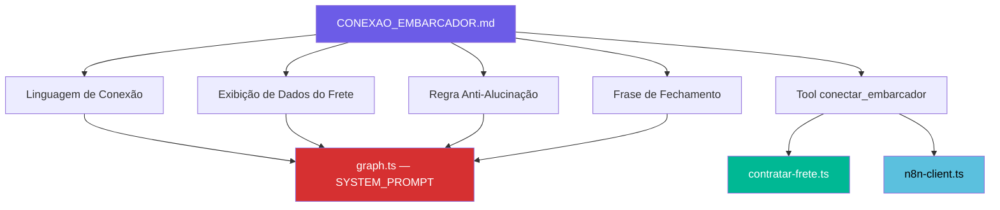
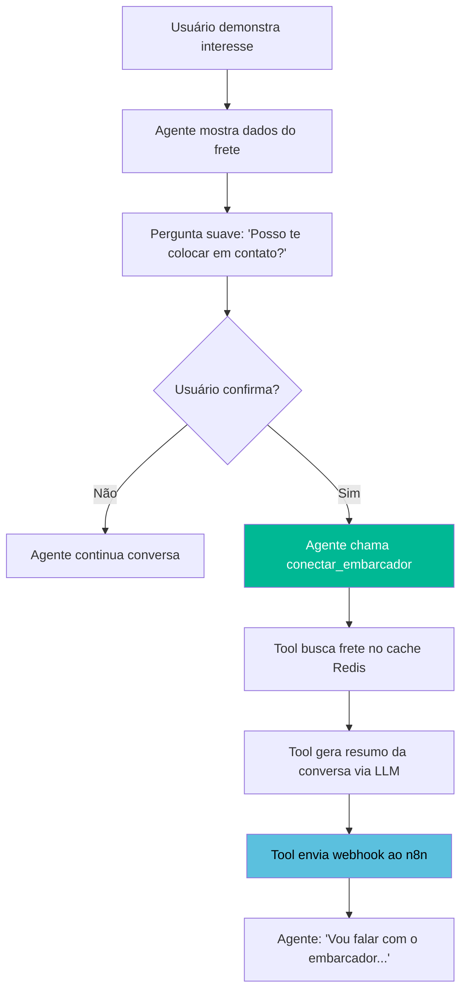
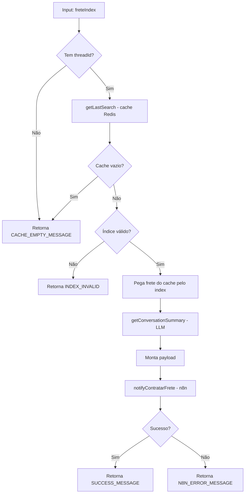
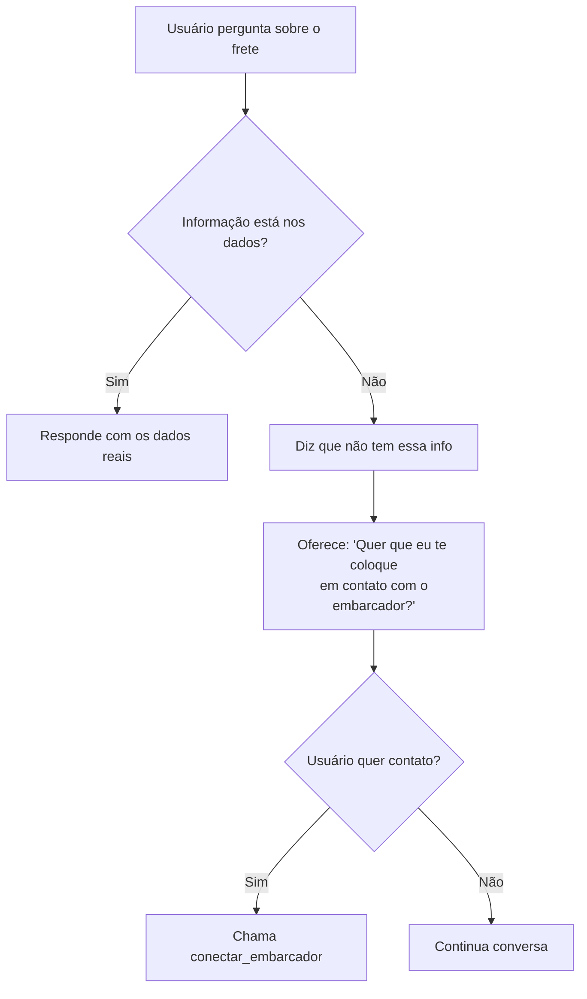

# Epic: Conexão com o Embarcador

> Documentação completa da feature de conexão caminhoneiro ↔ embarcador: linguagem, regras de prompt, exibição de dados e anti-alucinação.

---

## Visão Geral do Epic

O Rodezio **não fecha fretes**. Apenas faz a **ponte/conexão** do caminhoneiro com o embarcador. Este Epic documenta todas as mudanças necessárias para alinhar a linguagem, o fluxo e o comportamento do agente com essa premissa, garantindo que não haja promessas falsas e que o tom seja acolhedor e natural.

### Documento de Referência

[CONEXAO_EMBARCADOR.md](file:///c:/JONATAS/back/llm-rodezio/docs/CONEXAO_EMBARCADOR.md) — decisões e direção acordadas com o time.

### Mapa de Impacto



### Status Atual do Código

| Item | Status | Observação |
|------|--------|------------|
| Tool renomeada para `conectar_embarcador` | ✅ Feito | Nome interno, description e logs já atualizados em `contratar-frete.ts` |
| Mensagem de sucesso atualizada | ✅ Feito | Usa "Vou falar com o embarcador agora, logo ele entra em contato com você." |
| Prompt usa "fechar" | ⚠️ Pendente | Linhas 97, 112, 114, 115 do `graph.ts` ainda usam "fechar" |
| Prompt não omite campos vazios | ⚠️ Pendente | Prompt manda mostrar "Não informado" em vez de omitir |
| Regra anti-alucinação | ⚠️ Pendente | Não existe no prompt atual |
| Frase de fechamento da lista | ⚠️ Pendente | Usa "Qualquer um te interessa, me fala!" — pode ser refinada |

---

## Stories

| # | Story | Prioridade | Dependência |
|---|-------|-----------|-------------|
| 1 | Linguagem de Conexão no Prompt | 🔴 Alta | — |
| 2 | Tool `conectar_embarcador` — Fluxo Completo | 🔴 Alta | Story 1 |
| 3 | Exibição de Dados do Frete (Confirmação) | 🟡 Média | Story 1 |
| 4 | Regra Anti-Alucinação | 🔴 Alta | — |
| 5 | Frase de Fechamento da Lista | 🟢 Baixa | — |

---

## Story 1: Linguagem de Conexão no Prompt

> **Como** desenvolvedor, **quero** atualizar toda a linguagem do system prompt **para que** o agente nunca diga "fechar frete" e use termos que refletem o que realmente fazemos: a ponte entre caminhoneiro e embarcador.

### Arquivo

[graph.ts](file:///c:/JONATAS/back/llm-rodezio/src/agents/langgraph/graph.ts)

### Problema

O prompt atual ainda usa a palavra "fechar" em vários pontos:

| Linha | Texto atual | Problema |
|-------|------------|----------|
| 97 | `"quero fechar"` | Lista como sinônimo de contratar — OK como keyword de intenção do **usuário**, mas o agente não deve responder com "fechar" |
| 112 | `"Confirma pra eu fechar."` | Agente diz "fechar" — promessa falsa |
| 114 | `"eu fecho pra você agora"` | Agente diz "fecho" — promessa falsa |
| 115 | `"pode fechar"` | Na lista de confirmações do usuário — OK |

### Direção

**Eliminar** a palavra "fechar" de qualquer fala **do agente**. Manter como keyword de **detecção de intenção** do usuário (o caminhoneiro pode falar "quero fechar", mas o agente nunca responde com "fechar").

### Substituições Propostas

| De (agente fala) | Para |
|-----------------|------|
| `"Confirma pra eu fechar."` | `"É esse mesmo? Posso te colocar em contato com o embarcador?"` |
| `"eu fecho pra você agora. Confirma esse?"` | `"posso te colocar em contato com o embarcador desse frete. Confirma?"` |

### Sinônimos para "conectar" (priorizar no prompt)

De acordo com o doc `CONEXAO_EMBARCADOR.md`:

- **Colocar em contato** — direto, claro
- **Fazer a ponte** — informal, imagem concreta
- **Te coloco em contato** — pessoal, próximo

> ⚠️ Evitar "conectar" e "conexão" — soam técnicos para quem está na estrada.

### Regra adicional: Pedido de contato direto

Quando o usuário pede o contato/telefone/WhatsApp do embarcador:
- **NÃO** dizer que não pode ou não consegue
- **Dizer** que vai entrar em contato com o embarcador e que logo ele entrará em contato com o caminhoneiro
- Em paralelo, chamar `conectar_embarcador`
- **Jamais** mencionar a existência da ferramenta ou do endpoint

Exemplos: `"Vou falar com o embarcador agora, logo ele entra em contato com você."`, `"Beleza, aciono o responsável por esse frete e ele te procura em breve."`

### Acceptance Criteria

- [ ] Nenhuma fala do **agente** no prompt contém "fechar" ou "fecho"
- [ ] Keywords do **usuário** ("quero fechar", "pode fechar") mantidas para detecção de intenção
- [ ] Frases de confirmação usam "colocar em contato" ou "fazer a ponte" em vez de "fechar"
- [ ] Regra de pedido de contato direto adicionada ao prompt
- [ ] Tom suave e acolhedor na confirmação, sem soar como cobrança

---

## Story 2: Tool `conectar_embarcador` — Fluxo Completo

> **Como** desenvolvedor, **quero** documentação completa da tool `conectar_embarcador` **para que** eu entenda o fluxo inteiro de conexão caminhoneiro ↔ embarcador.

### Arquivo

[contratar-frete.ts](file:///c:/JONATAS/back/llm-rodezio/src/agents/langgraph/tools/contratar-frete.ts)

### Descrição

Tool que faz a ponte entre caminhoneiro e embarcador. Quando o caminhoneiro demonstra intenção de ser conectado (ex: "quero esse", "me interessa"), o agente confirma os dados e chama esta tool, que envia um webhook ao n8n notificando o embarcador.

> **Importante**: O nome do arquivo ainda é `contratar-frete.ts`, mas a tool já foi renomeada internamente para `conectar_embarcador`.

### Fluxo de 2 Etapas



| Etapa | Quem faz | O que acontece | Tom |
|-------|----------|----------------|-----|
| 1ª mensagem | Agente (LLM) | Mostra dados do frete + pergunta suave | "É esse mesmo? Posso te colocar em contato?" |
| 2ª mensagem | Agente chama `conectar_embarcador` | Após "sim"/"confirmo"/"pode" | Tool executa e retorna mensagem |

### Fluxo Interno da Tool



### Schema de Entrada

| Campo | Tipo | Obrigatório | Descrição |
|-------|------|-------------|-----------|
| `freteIndex` | `number` (1-15) | ✅ | Índice do frete na lista (1-based) |

### Mensagens Fixas

| Constante | Mensagem | Quando |
|-----------|----------|--------|
| `SUCCESS_MESSAGE` | "Vou falar com o embarcador agora, logo ele entra em contato com você." | Webhook enviado com sucesso |
| `CACHE_EMPTY_MESSAGE` | "Pesquise fretes antes de contratar..." | Sem threadId ou cache vazio |
| `INDEX_INVALID_MESSAGE` | "Não encontrei esse frete na lista..." | Índice fora do range |
| `N8N_ERROR_MESSAGE` | "Tive um problema para acionar o responsável agora..." | Erro no webhook |

### Payload enviado ao n8n

```json
{
  "messageId": "msg_abc123",
  "remoteJidEmbarcador": "5511999...",
  "rota": { "origem": "São Paulo", "destino": "Curitiba" },
  "frete": { "carrier_name": "G10", "price": 1234, "..." : "..." },
  "resumoConversa": "Caminhoneiro buscou fretes de SP para Curitiba...",
  "dadosUsuario": { "remoteJid": "5516997..." }
}
```

### Dependências

| Serviço | Uso |
|---------|-----|
| [search-cache.ts](file:///c:/JONATAS/back/llm-rodezio/src/agents/langgraph/services/search-cache.ts) | `getLastSearch()` — lê frete do cache Redis |
| [conversation-summary.ts](file:///c:/JONATAS/back/llm-rodezio/src/agents/langgraph/services/conversation-summary.ts) | `getConversationSummary()` — gera resumo com LLM |
| [n8n-client.ts](file:///c:/JONATAS/back/llm-rodezio/src/agents/langgraph/services/n8n-client.ts) | `notifyContratarFrete()` — webhook HTTP |
| [context.ts](file:///c:/JONATAS/back/llm-rodezio/src/agents/langgraph/context.ts) | `getThreadId()` — obtém threadId do AsyncLocalStorage |

### Acceptance Criteria

- [ ] Documenta o fluxo de 2 etapas com tom suave (quem faz o quê)
- [ ] Explica a dependência do cache Redis (setLastSearch → getLastSearch)
- [ ] Documenta o payload enviado ao n8n com todos os campos
- [ ] Descreve cada mensagem fixa e quando aparece
- [ ] Linguagem nunca usa "fechar" — usa "colocar em contato" / "fazer a ponte"

---

## Story 3: Exibição de Dados do Frete (Confirmação)

> **Como** desenvolvedor, **quero** regras claras de exibição dos dados do frete no momento da confirmação **para que** o agente mostre apenas informação útil e não polua a mensagem com campos vazios.

### Arquivo

[graph.ts](file:///c:/JONATAS/back/llm-rodezio/src/agents/langgraph/graph.ts)

### Problema Atual

O prompt atual instrui o agente a mostrar TODOS os campos do frete, usando "Não informado" para valores vazios. Isso polui a mensagem e afeta a experiência.

### Regras Novas (do doc CONEXAO_EMBARCADOR.md)

| Regra | Descrição |
|-------|-----------|
| Campos vazios | **Omitir** o campo inteiro — não mostrar "Não informado" |
| Ordem dos campos | A IA organiza como fizer mais sentido (sem ordem fixa obrigatória) |
| Frase de transição | Obrigatória antes dos dados ("Beleza, esse aqui...", "O frete é esse:") |
| Transição + pergunta | Na **mesma mensagem** — mostra os dados e pergunta se quer ser conectado |
| Pesquisa flexível | Sem diferença nos dados — a IA contextualiza ("Esses são os fretes pro destino X") |

### Exemplo: Antes vs Depois

**Antes** (atual):
```
*G10*
📍 Rota: Rio Verde-GO → Santos-SP
📦 Produto: Sementes
💰 Valor: R$ 314,00
🚚 Tipo de veículo: Não informado
⚖️ Peso: Não informado
📅 Data: 07/03/2026
```

**Depois** (proposto):
```
*G10*
📍 Rota: Rio Verde-GO → Santos-SP
📦 Produto: Sementes
💰 Valor: R$ 314,00
📅 Data: 07/03/2026
```

### Perguntas Abertas (para o time)

1. **Campos vazios** — Omitir completamente ou há campos que devem **sempre** aparecer (ex: rota e valor)?
2. **Múltiplos campos vazios** — Se rota, valor e data vierem preenchidos mas produto, veículo e peso vierem vazios, mostramos só os três primeiros?
3. **Transição + pergunta** — A frase de transição e a pergunta "Posso te colocar em contato?" vêm na mesma mensagem?

### Acceptance Criteria

- [ ] Prompt atualizado para omitir campos com valor vazio/null/UNKNOWN
- [ ] Prompt mantém frase de transição antes dos dados
- [ ] Confirmação e pergunta de conexão na mesma mensagem
- [ ] Pesquisa flexível tem contextualização adequada ("fretes pro destino X")

---

## Story 4: Regra Anti-Alucinação

> **Como** desenvolvedor, **quero** uma regra no prompt que impeça a IA de inventar informações **para que** o caminhoneiro nunca receba dados falsos sobre os fretes.

### Arquivo

[graph.ts](file:///c:/JONATAS/back/llm-rodezio/src/agents/langgraph/graph.ts)

### Problema

Quando o caminhoneiro faz perguntas sobre detalhes do frete (ex: "O pedágio tá incluso no valor?"), a IA **inventa** a resposta. Isso é perigoso porque cria expectativas falsas.

### Exemplos Reais

| Pergunta do caminhoneiro | Resposta da IA (errada) | O que deveria dizer |
|--------------------------|------------------------|---------------------|
| "O pedágio já está incluso?" | "Sim, o valor já inclui pedágio." | "Isso aí não tá no sistema, não sei te dizer. Quer que eu te coloque em contato com o embarcador pra ele te falar?" |
| "Prazo de pagamento?" | "O pagamento é no ato da entrega." | "Essa informação eu não tenho aqui. Quer falar com o embarcador?" |

### Regra Proposta para o Prompt

```
INFORMAÇÕES DO FRETE (REGRA ANTI-ALUCINAÇÃO):
- Se o usuário perguntar algo que NÃO está explícito nos dados do frete ou na conversa:
  NÃO invente, NÃO suponha, NÃO deduza.
- Responda que não tem essa informação e ofereça colocar o caminhoneiro em contato
  com o embarcador para esclarecer.
- Tom: "Isso aí não tá no sistema, não sei te dizer. Quer que eu te coloque em contato
  com o embarcador pra ele te falar?"
- Exemplos de perguntas perigosas: pedágio incluso, prazo de pagamento,
  tipo de carga, documentação, seguro, fila na balança.
```

### Comportamento Esperado



### Perguntas Abertas (para o time)

1. **Implícita vs explícita** — "Frete de grãos provavelmente usa graneleiro" é aceitável ou só vale o que está literalmente nos dados?
2. **Perguntas impossíveis** — "Vai ter fila na balança?" — nem o embarcador sabe. A IA oferece contato igual ou só diz que não sabe?
3. **Tom da negativa** — "Não sei dizer" está OK ou preferir algo mais suave?

### Acceptance Criteria

- [ ] Regra anti-alucinação adicionada ao system prompt
- [ ] Agente nunca inventa dados sobre fretes
- [ ] Ao não saber, oferece contato com o embarcador (tom natural)
- [ ] Tom da negativa validado ("Isso aí não tá no sistema...")

---

## Story 5: Frase de Fechamento da Lista

> **Como** desenvolvedor, **quero** que a frase de fechamento da lista de fretes seja natural e alinhada com o que fazemos **para que** o caminhoneiro se sinta convidado a interagir.

### Arquivo

[graph.ts](file:///c:/JONATAS/back/llm-rodezio/src/agents/langgraph/graph.ts)

### Frase Atual

```
"Qualquer um te interessa, me fala!"
```

### Alternativas (do doc CONEXAO_EMBARCADOR.md)

| Frase | Observação |
|-------|------------|
| "Algum te interessa? Me fala!" | Direta |
| "Qualquer um que te sirva, me avisa!" | Natural |
| "Se algum te chamar atenção, manda!" | Mais dinâmico, convida à ação ✨ |

> Todas estão alinhadas com o que fazemos — nenhuma promete "fechar".

### Acceptance Criteria

- [ ] Frase de fechamento atualizada no prompt
- [ ] Variação natural (a IA pode alternar entre as opções)
- [ ] Nenhuma promessa implícita de fechamento de frete

---

## Estrutura de Pastas

```
docs/features/conexao-embarcador/
├── epic.md                                 # Este documento
├── stories/
│   ├── 01-linguagem-conexao-prompt.md
│   ├── 02-tool-conectar-embarcador.md
│   ├── 03-exibicao-dados-frete.md
│   ├── 04-regra-anti-alucinacao.md
│   └── 05-frase-fechamento-lista.md
```
